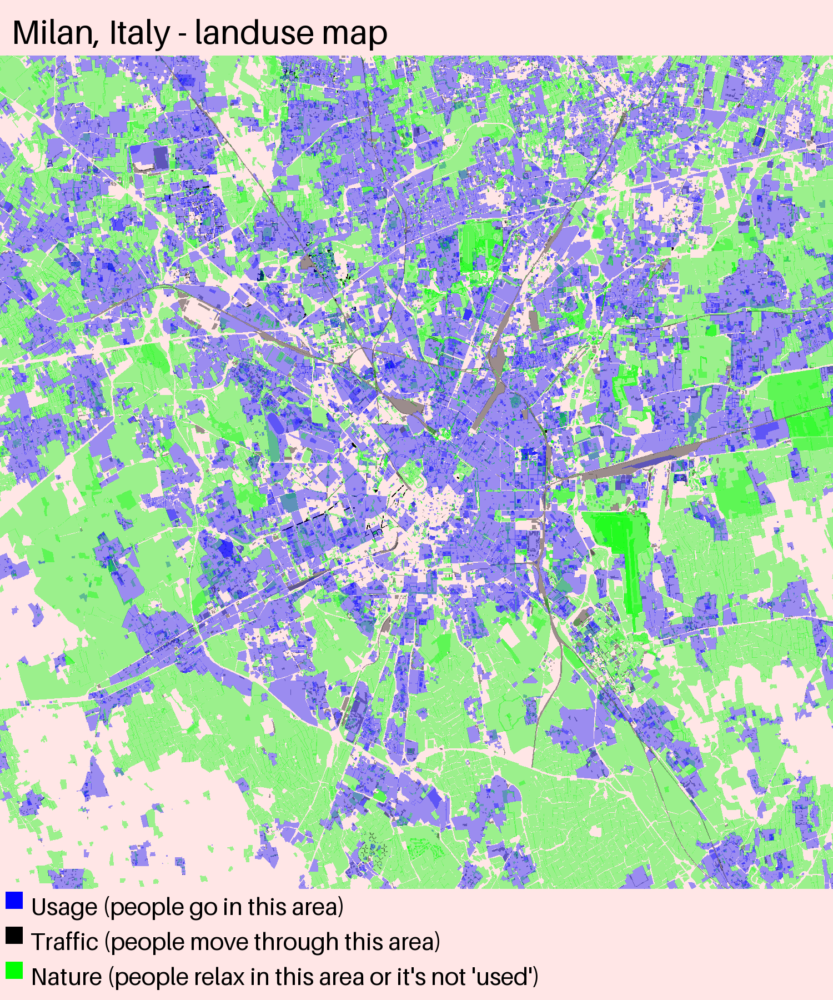

---
# You can also start simply with 'default'
theme: default
# random image from a curated Unsplash collection by Anthony
# like them? see https://unsplash.com/collections/94734566/slidev
background: mapillary_20241105_screenshot.png
# some information about your slides (markdown enabled)
title: Contributing 360° images to Mapillary
# apply unocss classes to the current slide
class: text-center
# https://sli.dev/features/drawing
drawings:
  persist: false
# slide transition: https://sli.dev/guide/animations.html#slide-transitions
transition: slide-left
# enable MDC Syntax: https://sli.dev/features/mdc
mdc: true
# take snapshot for each slide in the overview
overviewSnapshots: true
---

# Contributing 360 images to Mapillary

By Jacopo Farina, for Walkabout Milano, 2024-11-05 @ Meta

---
transition: fade-out
layout: image-left
image: /me.jpg
---

# Who am I?

* Contributor to OSM since many years
* Contributed to Mapillary also for years, from a phone camera
* GIS/cartography "enthusiast"
* Work as a developer but in a completely different field, and as a teacher

Github: [jacopofar](https://github.com/jacopofar/)

Tech blog: [jacopofarina.eu](https://jacopofarina.eu/)

Website about Milan (very much WIP)c: [Milanorama](https://milanorama.com/)

---
transition: slide-up
level: 2
---

# Why Mapillary

Mapillary gives you an **historical** archive of geolocated images, that can be
used **freely**.

Perfect as a reference for OSM data, machine learning or artistic projects.

For micromapping, you can see details not visible from satellite pictures or
hard to add on the fly using mobile apps. It is directly integrated in the *Id*
editor.

Mapillary/Meta does blur faces and plates, extract common features and generates
point clouds.

---

Machine Learning based on Mapillary data

<iframe width="560" height="315" src="https://www.youtube.com/embed/nNMmz6Ei9Qg?si=c5rGdlXcnkUQmY0S" title="YouTube video player" frameborder="0" allow="accelerometer; autoplay; clipboard-write; encrypted-media; gyroscope; picture-in-picture; web-share" referrerpolicy="strict-origin-when-cross-origin" allowfullscreen></iframe>

[Bike Map - Using Computer Vision for Bike Routing: an ML project by Campbell, Monika and Edith](https://www.youtube.com/watch?v=nNMmz6Ei9Qg)

---
layout: two-cols-header

---

# Using a GoPro Max 360

I was contacted a few months ago by Meta’s Reality Lab. They saw my
contributions in Milan and offered me to borrow their GoPro MAX 360 which was
not used anymore by another Mapillary contributor.

::left::
The camera is mounted on the bike helmet.

::right::

An unprocessed frame:

---

# Going by bike

I decided to use the camera on the bike since:

* Mapillary has probably less coverage in Milan on parks and bike lanes
* A bike can be very fast and efficient compared to walking
* It's fun!

As it turns out, a 360 camera is **way** more effective than a phone. On a bike,
even better.
---

# Where to go?

Initially at will, later planning and trying to cover new areas each time.

* Personal favorites: my high school, where I usually go running, the area
 near my home
* Parks, like Parco Nord

---
layout: two-cols-header
---

# "Historical" footage

Passing in Ca Granda, where 360 pictures where made in 2020, we can see the
effect of the energy efficiency intervention (thermal coat).

This particular intervention is a [case study for BPIE (Building Performance
Institute Europe).](https://blog.urbanfile.org/2023/12/27/milano-pratocentenaro-efficientamento-energetico-alle-torri-ca-granda-dicembre-2023/)

::left::
In 2020, loaded by Lorenzo Stucchi:

::right::

In 2024, loaded by Jacopo Farina:

---
layout: two-cols-header
---

# Areas covered so far
::left::

::right::

* Parco Nord
* Niguarda
* Bicocca
* Villaggio dei giornalisti
* Maciachini

Plan to go further in Bovisa / Affori, hopefully also the city center.

Rain and lack of sunlight are a problem.

---

# Some sparse notes

* It's better to go during the day, with full light, ideally a bit cloudy to
 avoid direct sunlight (still ok)

* Vibrations and speed are not a problem

* The camera is very conspicuous, a group of kids asked me whether I was
 a "youtuber" :)

* Check to use the correct mode, timelapse and not video. With it you can record
 more than 2 hours and the file is going to be around 4 GB.
 Quality also improves.

* I prefer to also use a fitness tracker to track my movements, but is not
 necessary

---

# Micromapping

These images can be used to extract a lot of details very hard to get otherwise.

Unusual examples: street name etimology and tree species.

---
layout: two-cols-header
---

# Using the data from OSM

Have you heard of `#30DayMapChallenge`?

For each day of November you try to
create a map. OSM data is of course an excellent starting point

::left::

::right::

Data from OSM can be queried with Overpass, or loaded into a PostGIS instance.

Now with QuackOSM and DuckDB it's even easier to query this data.

---

# Something silly

You can use OSM data to procedurally generate game levels. Here an example from
an old demo, built with Godot. Trees and roads are from the map data, and NPCs know
the name of the street where they are. The code is on [Github](https://github.com/jacopofar/godot-4-tiledmap).
Imagine what could be done with Mapillary (and VR?).

---

# Questions?

Happy mapping!